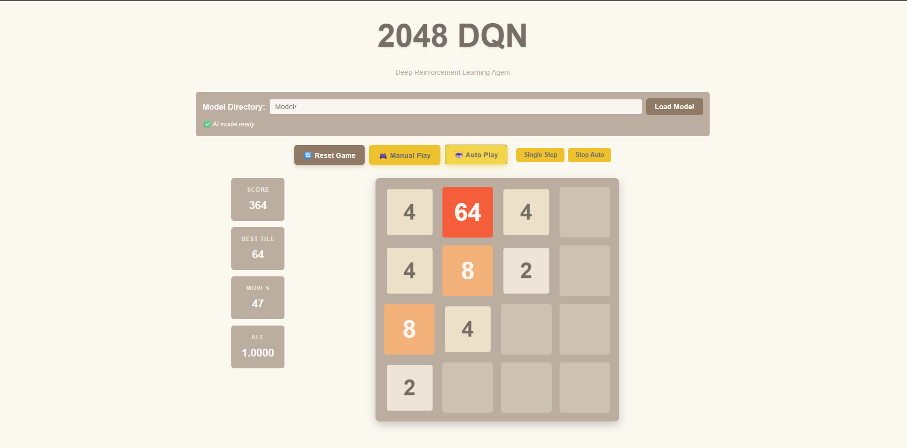

## 2048 Deep Q-Network Playground

> 
This project trains a Deep Q-Network (DQN) agent to play the classic 2048 puzzle. It includes:

- A clean NumPy implementation of the 2048 environment (`game2048/game.py`).
- A TensorFlow 2 based DQN agent with replay buffer support (`game2048/agent.py`).
- Training utilities and a command line/Notebook workflow (`game2048/train.py`, `notebooks/Train.ipynb`).
- A comprehensive Flask web app with original 2048 design (`flask-app/`).

## Getting started

1. **Create/activate an environment**

    ```cmd
    conda create -n 2048-rl-env python=3.10 -y
    conda activate 2048-rl-env
    pip install -r requirements.txt
    ```

2. **Run the unit tests (optional sanity check)**

    ```cmd
    pytest tests -v
    ```

## Training the agent

There are two supported training paths:

### Command line

```cmd
python game2048\train.py --episodes 500 --log-every 10 --save-every 50 --eval-every 50
```

Key arguments are documented via `python game2048\train.py --help`. Models are saved under `Model/` by default (`dqn_checkpoint.keras` plus episodic checkpoints).

### Notebook workflow

Open `notebooks/Train.ipynb` to run an interactive training session. The notebook:

- Loads helper utilities and displays the configuration table.
- Launches a demo training run (default 200 episodes, tweak as needed).
- Plots score progression and epsilon decay.
- Evaluates the trained agent over several deterministic games.
- **Supports checkpoint resumption**: automatically detects and loads existing checkpoints.

The notebook stores artifacts under `Model/run-YYYYMMDD-HHMMSS/` with automatic timestamp folders.

## Playing with the AI (Flask Web App)

### 🎮 Enhanced GUI (Recommended)

Launch the full-featured Flask application:

```cmd
cd flask-app
python app.py
```

Then open <http://localhost:5000> in your browser for the complete 2048 DQN experience.

#### Features

**🎮 Dual Play Modes:**
- **Manual Play**: Use arrow keys or on-screen buttons to play yourself
- **Auto Play**: Watch the AI agent play automatically with adjustable speed

**🤖 Smart Model Loading:**
- Enter any model directory path (e.g., `Model/` or `Model/run-20250927-134259/`)
- Automatically finds and loads the best available checkpoint
- Supports `.keras` files with intelligent fallback selection

**📊 Real-time Stats:**
- Live score, best tile, move count
- Agent epsilon (exploration rate)
- Move history with manual/AI annotations

**🎯 Original 2048 Design:**
- Authentic color scheme and tile animations
- Responsive design for mobile and desktop
- Smooth transitions and visual feedback

### Alternative (Basic GUI)

For the minimal interface:

```cmd
flask --app gui.gui run --reload
```

## Project structure

```
├── Model/                 # Saved checkpoints (created at runtime)
│   └── run-YYYYMMDD-HHMMSS/
│       ├── logs/          # TensorBoard logs
│       ├── dqn_checkpoint.keras
│       ├── dqn_ep*.keras  # Episode checkpoints
│       └── training_history.json
├── flask-app/             # Enhanced Flask web application
│   ├── app.py            # Main Flask server
│   ├── static/           # CSS, JS, assets
│   └── templates/        # HTML templates
├── game2048/             # Environment, agent, and training utilities
├── gui/                  # Basic Flask interface
├── notebooks/            # Exploration and training notebooks
├── tests/                # Pytest-based smoke tests
├── docs/                 # Reference material
└── requirements.txt      # Python dependencies
```

## Tips & next steps

- Experiment with different reward shaping parameters in `TrainingConfig` (invalid move penalty, target tile bonus).
- Increase episode counts and adjust replay warm-up for stronger policies.
- The training system now supports **checkpoint resumption** - just rerun the notebook or training script.
- Deploy the Flask app to Render, Railway, or similar to share an interactive demo.
- Use the Flask app's auto-play mode to benchmark different trained models.